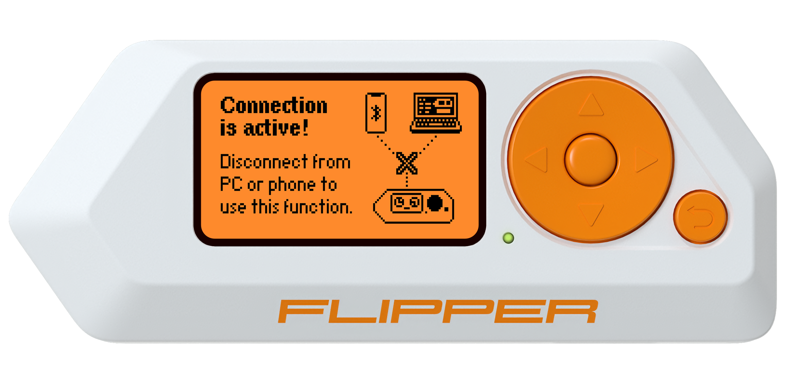

# flipperzero-frame
A simple script to insert a qFlipper screenshot into a Flipper Zero frame

## Requirements
* `pillow` library

## Usage
```
python3 frame.py filename.png
```

Will output `framed_filename.png` file.

 